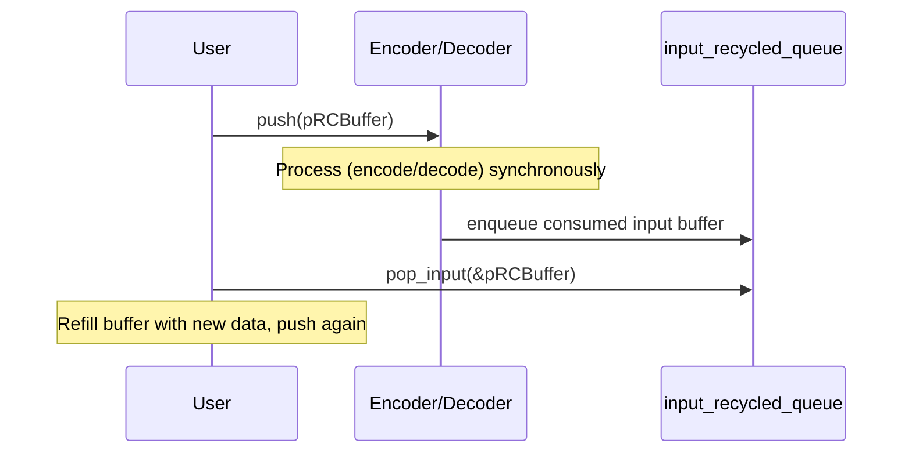
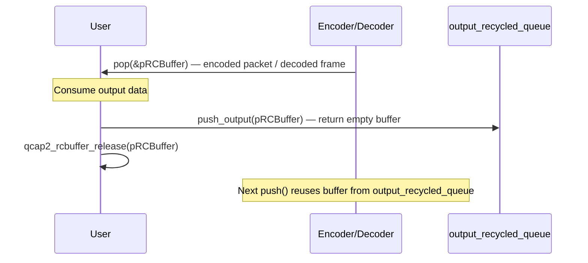

# Encoder / Decoder — rcbuf-queue Recycle Process

## Overview

The QCAP2 encoder and decoder components use a **dual-queue recycling** system to achieve **zero-allocation** steady-state operation. Instead of allocating and freeing buffers every frame, buffers circulate in closed loops between the user and the component. Two named patterns govern this:

| Pattern | Full Name | Direction | Purpose |
|---------|-----------|-----------|---------|
| **HPR** | Push-Pop-Release (input side) | user → component → user | Recycle consumed **input** buffers back to the user |
| **PPR** | Pop-Push-Release (output side) | component → user → component | Recycle consumed **output** buffers back to the component |

---

## The Two Recycling Models

### 1. HPR — Input Recycling (Push → Pop-Input)



**Step-by-step:**

1. The user calls **`push(pRCBuffer)`** to submit a buffer (raw frame for encoder, compressed packet for decoder).
2. The component processes the data synchronously.
3. After processing, the component **automatically pushes the consumed input `pRCBuffer`** to an internal `input_recycled_queue`.
4. The user calls **`pop_input(&pRCBuffer)`** to retrieve the now-empty input buffer.
5. The user refills it with new data and pushes again — **no allocation needed**.

### 2. PPR — Output Recycling (Pop → Push-Output → Release)



**Step-by-step:**

1. The user calls **`pop(&pRCBuffer)`** to retrieve the output (encoded packet from encoder, decoded frame from decoder).
2. The user consumes the data.
3. The user calls **`push_output(pRCBuffer)`** to return the empty buffer shell back to the component's `output_recycled_queue`.
4. The user calls **`qcap2_rcbuffer_release(pRCBuffer)`** to release ownership.
5. On the next `push()`, the component **pops a buffer from `output_recycled_queue`** instead of allocating a new one.

---

## Complete Data Flow Diagram

### Video Encoder

```
         User (producer)                      Video Encoder                     User (consumer)
        ┌──────────────┐               ┌─────────────────────┐               ┌──────────────┐
        │              │               │                     │               │              │
  ┌───► │ Fill raw      │──push()─────►│ Encode (libx264)    │──pop()───────►│ Read packet  │
  │     │ frame data   │               │                     │               │              │
  │     └──────────────┘               │  input_recycled_q ◄─┤               └──────┬───────┘
  │            ▲                       │                     │                      │
  │            │                       │  output_recycled_q──┤◄──push_output()──────┤
  │            │                       └─────────────────────┘                      │
  │     pop_input()                                                        release()
  │            │                                                                   │
  └────────────┘                                                                   ▼
      HPR loop                                                                PPR loop
  (input recycling)                                                     (output recycling)
```

### Video Decoder

```
         User (producer)                      Video Decoder                     User (consumer)
        ┌──────────────┐               ┌─────────────────────┐               ┌──────────────┐
        │              │               │                     │               │              │
  ┌───► │ Fill packet   │──push()─────►│ Decode (libavcodec) │──pop()───────►│ Read decoded │
  │     │ data         │               │                     │               │ frame        │
  │     └──────────────┘               │  input_recycled_q ◄─┤               └──────┬───────┘
  │            ▲                       │                     │                      │
  │            │                       │  output_recycled_q──┤◄──push_output()──────┤
  │            │                       └─────────────────────┘                      │
  │     pop_input()                                                        release()
  │            │                                                                   │
  └────────────┘                                                                   ▼
      HPR loop                                                                PPR loop
  (input recycling)                                                     (output recycling)
```

> [!NOTE]
> The same HPR/PPR pattern applies identically to `qcap2_audio_encoder_t` and `qcap2_audio_decoder_t`.

---

## How It Differs from Pool-Based Recycling

There is a **third** recycling mechanism used alongside HPR/PPR — the **buffer pool** (`qcap2_frame_pool_t` / `qcap2_packet_pool_t`):

| Mechanism | Where buffers live | Recycled by | When a buffer is "idle" |
|-----------|-------------------|-------------|------------------------|
| **HPR** (input_recycled_queue) | Queue inside encoder/decoder | `pop_input()` | When it appears in the queue |
| **PPR** (output_recycled_queue) | Queue inside encoder/decoder | `push_output()` | When it appears in the queue |
| **Pool** (frame_pool / packet_pool) | Array inside pool | `qcap2_rcbuffer_release()` | When `use_count == 1` |

The pools use **reference-count scanning** — the pool always holds one ref, so `use_count == 1` means nobody else is using the buffer. The HPR/PPR queues use **explicit queue-based handoff** — buffers are explicitly moved between producer and consumer via queue operations.

> [!IMPORTANT]
> The decoder's `push()` also has a **hybrid** strategy for obtaining output buffers: it first tries `set_buffers()` registered buffers (pool-style `use_count == 1` scan), then the `output_recycled_queue` (PPR), and finally falls back to dynamic allocation. See [VIDEO-DECODER.md](file:///home/zzlee/docker/qcap2-dev/wiki/VIDEO-DECODER.md#L131).

---

## Auto-Recycle via `set_buffers()` on `qcap2_rcbuffer_queue_t`

There is also a **self-recycling queue** mode shown in [4-rcbuf-queue.cpp](file:///home/zzlee/docker/qcap2-dev/usecases/4-rcbuf-queue.cpp):

```cpp
qcap2_rcbuffer_queue_set_buffers(pRCBufferQ, pRCBuffers);
// Hooks pOnFreeResource on each buffer so that release() → auto-re-enqueue
```

In this mode, calling `qcap2_rcbuffer_release()` on a popped buffer **automatically re-enqueues** it back into the same queue when the ref count reaches zero. This creates a fully closed-loop recycling queue without needing explicit `push_output()` calls.


This is distinct from the encoder/decoder HPR/PPR model where the user manually drives the recycle.

---

## Summary

| Component Side | User Action | Internal Queue | Effect |
|---------------|-------------|----------------|--------|
| **Input** (HPR) | `push()` → `pop_input()` | `input_recycled_queue` | User gets back their input buffer to refill and re-push |
| **Output** (PPR) | `pop()` → `push_output()` → `release()` | `output_recycled_queue` | Component gets back its output buffer to reuse on next encode/decode |
| **Queue auto-recycle** | `pop()` → `release()` | Same queue (via `pOnFreeResource` hook) | Buffer auto-returns to queue on last release |

The key design goal: **after the initial allocation during `start()`, the steady-state hot path involves zero `malloc`/`free` calls**.
